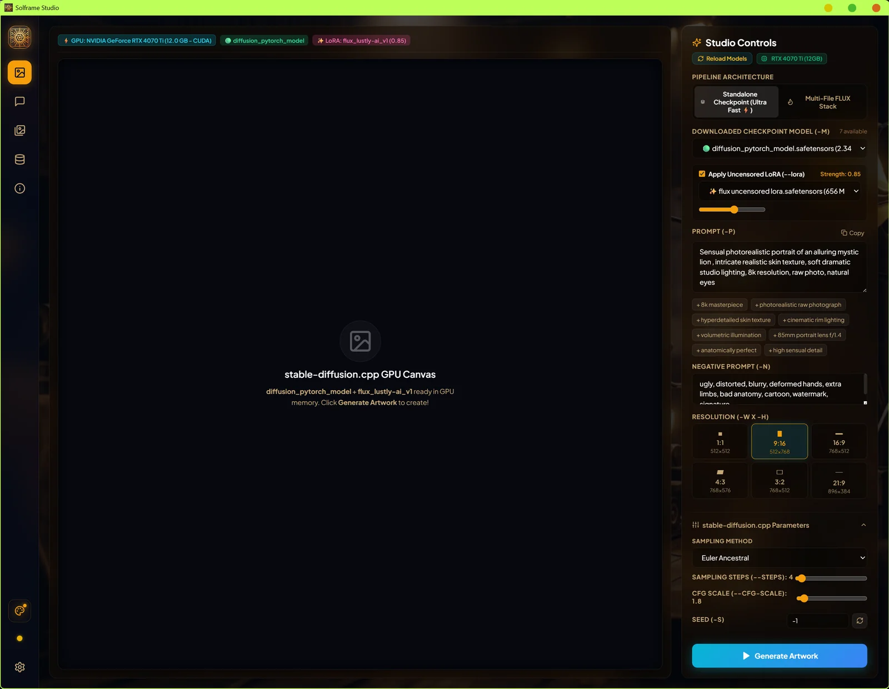
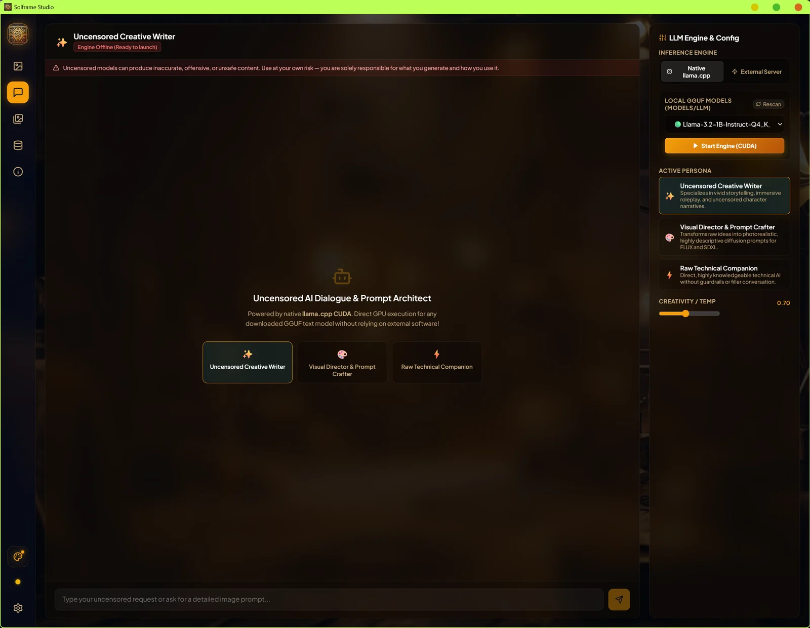
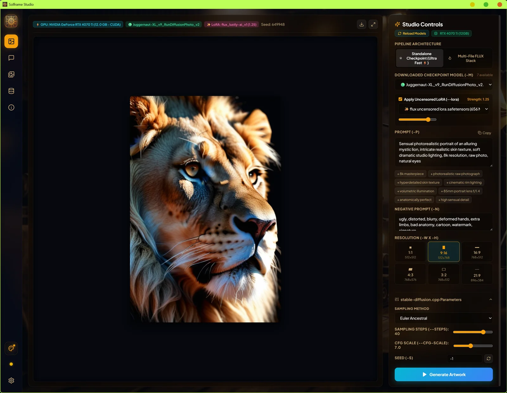
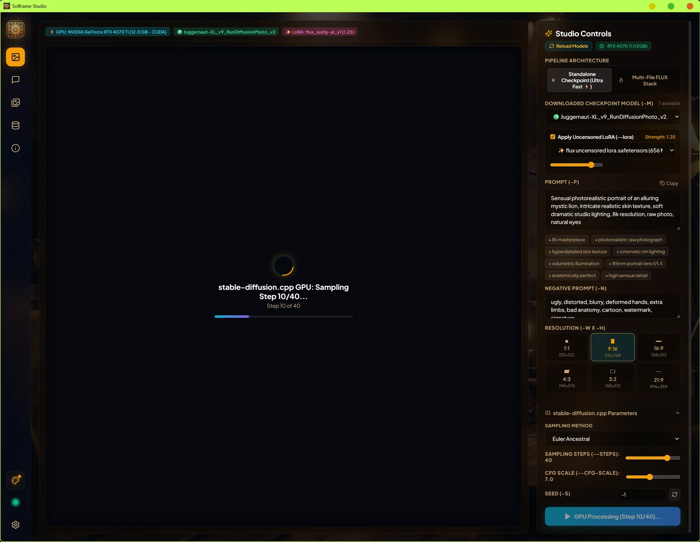

<div align="center">

# ✨ Solframe Studio

**Autonomous, Sovereign & Zero-Cloud Local Generative AI Workstation**

[](https://github.com/Protik1810/Solframe-Studio)
[](https://github.com/Protik1810/Solframe-Studio)
[](https://github.com/leejet/stable-diffusion.cpp)
[](https://github.com/ggerganov/llama.cpp)
[](LICENSE)
[](https://github.com/Protik1810/Solframe-Studio/actions/workflows/ci.yml)

<br/>

*Designed & Engineered by **Protik***

</div>

---

## 🌟 Overview

**Solframe Studio** is a standalone, self-contained desktop generative AI suite engineered for 100% private, offline inference. Combining **`stable-diffusion.cpp`** (supporting FLUX.2 Klein, SDXL Lightning, and standard SD checkpoints) with **`llama.cpp`** (running GGUF text models with full GPU offloading), Solframe Studio brings high-performance generative AI directly to consumer hardware with zero subscription fees, zero cloud telemetry, and complete offline autonomy.

> **Platform status:** all three platforms ship real, working inference engines — verified on Windows 11, macOS Apple Silicon (M2), and Linux on CUDA (RTX 4060, 8 GB) — image generation and local LLM chat run out of the box. Windows uses CUDA/Vulkan/CPU (`backend/win/**`), macOS uses Metal on Apple Silicon (`backend/mac/**`), and Linux uses Vulkan/CPU (`backend/linux/**`). Vulkan on Linux drives NVIDIA, AMD and Intel GPUs alike, because neither upstream engine publishes a prebuilt Linux CUDA binary.

<div align="center">
<table>
<tr>
<td align="center"><br/><sub>Image Studio</sub></td>
<td align="center"><br/><sub>LLM Chat</sub></td>
</tr>
<tr>
<td align="center"><br/><sub>Standard checkpoint pipeline (SDXL + LoRA)</sub></td>
<td align="center"><br/><sub>Live sampling progress</sub></td>
</tr>
</table>
</div>

### 🖼️ Generated with Solframe Studio

Real output from both pipelines, unedited — prompt included for each. Solframe Studio is an uncensored tool; the examples below are kept safe-for-work on purpose, since this README is public.

<div align="center">
<table>
<tr>
<td width="50%" valign="top" align="center">


**Standard checkpoint pipeline** (SDXL, `Juggernaut-XL_v9` + a LoRA)
> Sensual photorealistic portrait of an alluring mystic lion, intricate realistic skin texture, soft dramatic studio lighting, 8k resolution, raw photo, natural eyes

</td>
<td width="50%" valign="top" align="center">


**FLUX.2 Klein pipeline** (`flux-2-klein-4b-fp8-official` + a LoRA)
> Candid 35mm photograph of an elderly Japanese ramen chef with intense focus, dusting flour off his hands over a steaming, boiling pot of rich tonkotsu broth in a tiny, atmospheric Tokyo alleyway stall at night. Thick white volumetric steam swirls upward, backlit by warm vintage pendant lights hanging from the wooden ceiling...

</td>
</tr>
</table>
</div>

**FLUX Kontext-style reference-image editing** (`-r/--ref-image` — attach an image, describe the change, no re-generating from scratch):

<div align="center">
<table>
<tr>
<td width="50%" align="center"><br/><sub>Original (attached as the reference image)</sub></td>
<td width="50%" align="center"><br/><sub>Edit prompt: <code>change the action pose</code></sub></td>
</tr>
</table>
</div>

Another edit, on a different reference image:

<div align="center">
<table>
<tr>
<td width="50%" align="center"><br/><sub>Original (attached as the reference image)</sub></td>
<td width="50%" align="center"><br/><sub>Edit prompt: <code>change the lady to a man</code></sub></td>
</tr>
</table>
</div>

---

## 🚀 Key Features

### 🎨 1. Image Studio (Multi-Architecture Diffusion)
- **FLUX.2-Klein Architecture Support**: Auto-configured `--prediction flux_flow` with 32-channel VAEs (`flux2-vae.safetensors` / `ae.safetensors`) and safetensors text encoders — GGUF is reserved for LLM Chat, not image generation.
- **Flash Attention + RAM Offload**: `--diffusion-fa` runs by default on the FLUX pipeline, and weight offloading to system RAM auto-enables above ~512x512 to avoid VRAM overflow on constrained cards — both are silent, automatic optimizations, not settings you need to tune.
- **Automatic Base-Model Detection**: FLUX.2 Klein's distilled and "base" (non-distilled) variants need very different steps/cfg defaults — Studio detects which one is loaded from the filename and switches automatically.
- **SDXL Lightning & Turbo**: 4-step ultra-fast photo-realistic generation.
- **LoRA Support**: One LoRA slot with a real-time strength slider, applied via `--lora-model-dir`. Must match the loaded diffusion model's architecture — a FLUX.1 LoRA is not compatible with a FLUX.2 Klein model (different hidden dimensions), so pick LoRAs trained specifically for the Klein size you're running.
- **Cancel Generation**: Abort a run mid-flight instead of waiting it out or force-closing the app.
- **Distraction-Free Canvas**: Pure studio neutral generation viewport for accurate color fidelity.

### 💬 2. Uncensored Local LLM Chat
- **Native `llama.cpp` GPU Server**: Stream tokens in real time from quantized GGUF models (DeepSeek, Qwen 2.5, Gemma 4, Llama 3, Dolphin).
- **Configurable Load Parameters**: Context Length, GPU Layers, Batch Size, and Flash Attention, set before loading instead of hardcoded.
- **Custom Personas**: Seamless roleplay switching (Unfiltered Storyteller, Visual Director & Prompt Crafter, Raw Technical Companion).
- **Cross-Studio Pipeline**: Send generated prompts directly to the Image Studio with one click.

### 🎮 3. Dynamic Hardware Auto-Detection
- **NVIDIA GPUs**: Auto-routes to **CUDA** — `backend/win/cuda/` on Windows, `backend/linux/cuda/` on Linux. Upstream publishes no prebuilt Linux CUDA binary, so that one is compiled from source ([`scripts/build-linux-cuda.sh`](scripts/build-linux-cuda.sh)) and bundled with its CUDA runtime; where it isn't present the app falls back to **Vulkan**, which drives NVIDIA, AMD and Intel alike.
- **Hybrid-graphics laptops**: the discrete GPU is detected and selected explicitly — the engine otherwise defaults to GPU 0, usually the integrated chip, and runs out of memory while the real card idles.
- **AMD Radeon & Intel Arc GPUs**: Auto-routes to **Vulkan** (`backend/win/vulkan/`, `backend/linux/vulkan/`) using cross-platform compute shaders.
- **CPU Fallback**: Automatic multi-threaded AVX2 CPU execution when no discrete GPU is found.

### 🗄️ 4. Universal Dynamic Model Scanner
- **Multi-Drive Auto-Discovery**: Dynamically detects mounted drive letters (`C:`, `D:`, `E:`, `Z:`) and indexes standard AI directories (`/models`, `/ComfyUI/models`, `/stable-diffusion-webui/models`, `/LLM`).
- **Instant Load with Disk Cache**: Persists scan indices to `~/.solframe/scan_cache.json` for sub-millisecond cold starts.
- **Hugging Face Hub Downloader**: Built-in repository tree explorer with real-time download speed and progress tracking, and cancellable mid-transfer. Built on Node's own `fetch` (no external `curl` dependency), so this works on the Linux/macOS build too — not just Windows.

### 🌌 5. 6 Generative AI Ambient Themes
- **Visual Theme Gallery Modal**: Card previews of high-resolution AI-generated wallpaper backdrops.
- **Themes**:
  1. 🌌 **Dark Void** (Cosmic Neural Dust)
  2. ⚡ **Neon Cyber** (Rainy Cyberpunk Streets)
  3. 🎬 **Cinema Gold** (Vintage 35mm Hollywood Film Set)
  4. 🕶️ **Synthwave Sunset** (Retro 80s Wireframe Grid)
  5. 🌸 **Anime Fantasy** (Ethereal Sakura Shrine Twilight)
  6. 🟢 **Emerald Matrix** (Bioluminescent Cyber Mainframe)

### 🔌 6. Agent API Server
- **OpenAI-Compatible Endpoints**: `/v1/chat/completions` and `/v1/images/generations` — point any OpenAI-SDK-compatible tool or agent at your local engines.
- **Off by Default, API-Key Gated**: Enable it from Settings → Agent API Server. Bound to `127.0.0.1` only; every request (except `/health`) requires an `Authorization: Bearer <key>` header, checked with a constant-time comparison.
- **Auto-Starts the Right Model**: A chat request for a model that isn't currently loaded starts `llama-server` for it automatically — no separate "start engine" call needed.
- **Model Discovery**: `GET /v1/models` lists every GGUF/checkpoint the built-in scanner has already indexed on your system, ready to reference by filename.

---

## 🏗️ Architecture & Technology Stack

| Layer | Technology |
|---|---|
| **Desktop Wrapper** | Electron v36+ (Chromium runtime, dark chrome, custom tray & splash) |
| **Frontend Framework** | React 19 + TypeScript + Vite |
| **Styling** | Vanilla CSS Glassmorphism + Dynamic CSS Variables |
| **Image Synthesis Engine** | `stable-diffusion.cpp` (CUDA / Vulkan / CPU C++ kernels) |
| **Language Dialogue Engine** | `llama.cpp` (`llama-server.exe` CUDA / Vulkan) |
| **Model Persistence** | Global JSON Cache (`~/.solframe/scan_cache.json`) |
| **Testing** | Vitest — path resolution, model classification, local-server security (origin checks, path-traversal guards, POST-only enforcement), and CLI arg construction |

---

## 📦 Getting Started

### Prerequisites
- Windows 10/11 x64, Linux, or macOS
- Node.js (v18+) & npm

### 🪟 Windows Setup (Installer)
Download the latest installer from [Releases](https://github.com/Protik1810/Solframe-Studio/releases/latest):
- `Solframe-Studio-Setup-<version>.exe` — full installer (all backends)
- `Solframe-Studio-Setup-<version>-Lightweight.exe` — smaller download, **UI shell only, no image generation or local LLM chat**. There is currently no in-app way to fetch the missing engines afterward — use the Complete Installer if you need inference.

There is currently no winget package; the links above are the only official builds.

### 🍎 macOS Setup (Installer)
Download `Solframe-Studio-<version>-arm64-mac.zip` from [Releases](https://github.com/Protik1810/Solframe-Studio/releases/latest), unzip, and move `Solframe Studio.app` to Applications. Apple Silicon only — inference runs on Metal, which needs an M-series GPU. The build isn't code-signed/notarized, so the first launch needs **Control-click → Open** (not a double-click) to get past Gatekeeper — or run `xattr -cr "/path/to/Solframe Studio.app"` in Terminal if macOS reports it as "damaged."

### 🐧 Linux Setup (.deb)
Download `solframe-studio-<version>_amd64.deb` from [Releases](https://github.com/Protik1810/Solframe-Studio/releases/latest) and install it:
```bash
sudo dpkg -i solframe-studio-*_amd64.deb
```
This ships real inference engines (`backend/linux/**`): **Vulkan** for GPU generation and a CPU fallback, plus `llama.cpp` for chat. Vulkan drives NVIDIA, AMD and Intel GPUs alike — neither `stable-diffusion.cpp` nor `llama.cpp` publishes a prebuilt Linux CUDA binary, so Vulkan is the shipped GPU path. On a hybrid-graphics laptop the discrete GPU is picked automatically; the integrated one would otherwise run out of memory immediately.

> **No AppImage.** Every AppImage requires the legacy `libfuse2`, which current Ubuntu no longer ships, so it failed to launch out of the box. The `.deb` needs no such workaround.

## 🧠 Getting Models (First Run)

A fresh install ships with **no models** — the app is the engine, the models are yours to choose. Open **Model Hub → 🚀 Starter Packs** and it will offer a known-good set matched to your GPU, download it, and file each piece where the pipeline expects it. On a first run with nothing installed, the app opens on this tab automatically.

### Where models are stored

Downloads go to a folder you can actually find:

| Platform | Default location |
|---|---|
| Windows | `C:\Users\<you>\Downloads\Solframe Studio\` |
| macOS | `~/Downloads/Solframe Studio/` |
| Linux | `~/Downloads/Solframe Studio/` |

Inside it, files are sorted automatically — `models/checkpoints`, `models/unet`, `models/clip`, `models/vae`, `models/loras`, and `llm-models` for chat models. You can change the location any time (**Model Hub → Settings**), and the previous folder stays on the scan list so nothing disappears.

Already have a model library from ComfyUI, Automatic1111, LM Studio, Ollama, or Fooocus? The scanner finds those automatically — no copying required. You can also add any folder manually and it will be remembered.

> **Upgrading from v1.1.2 or earlier?** Downloads used to land in the hidden app-data folder (`%APPDATA%\Solframe Studio` / `~/Library/Application Support/Solframe Studio`). That folder is still scanned, so your existing models keep working — only *new* downloads go to Downloads.

### What the starter packs contain

Which pack you're shown depends on your VRAM. The full-precision FLUX stack is ~15.5 GB of weights and wants a 16 GB card; the fp8 stack is ~8.3 GB and is the right pick for 12 GB and below.

**Standard Checkpoint** — the fastest way to a first image. One self-contained SDXL file, nothing else needed:

| Model | Role | Size |
|---|---|---|
| RealVisXL V5.0 Lightning | All-in-one SDXL checkpoint, 4–6 steps | ~6.6 GB |

**FLUX.2 Klein** — higher quality, but needs three separate pieces that are useless individually:

| Model | Role | Size (full / fp8) |
|---|---|---|
| FLUX.2 Klein 4B | Diffusion model (UNet) — generates the image | 7.22 GB / 3.79 GB |
| Qwen3-VL 4B Heretic | Text encoder — turns your prompt into conditioning | 8.27 GB / 4.50 GB |
| FLUX.2 32-channel VAE | Decodes the result into a viewable image | ~335 MB |
| KLEIN Unchained V2 *(optional)* | LoRA — style/content adapter | ~311 MB |

**LLM Chat** — picked by device:

| Model | When | Size |
|---|---|---|
| Llama 3.2 3B Instruct Uncensored (Q4_K_M) | 4 GB VRAM or more | ~2.1 GB |
| Llama 3.2 1B Instruct Uncensored (Q4_K_M) | Low VRAM / CPU only | ~0.8 GB |

### Adding models by hand

Prefer to pick your own? **Model Hub** also has live Hugging Face search, a curated preset list, and a direct-URL downloader that accepts any Hugging Face or Civitai link — all of which file into the same sorted folders.

### Running in Development Mode
```bash
# 1. Clone repository
git clone https://github.com/Protik1810/Solframe-Studio.git
cd Solframe-Studio

# 2. Install dependencies
npm install

# 3. Lint and run unit tests
npm run lint
npm test

# 4. Start local development server
npm run dev
```

### Building the Desktop Executables & Installers
```bash
# Build production bundle
npm run build

# Windows: build Setup Installers (Complete + Lightweight)
npm run build:installer

# Linux: build the .deb (ships Vulkan/CPU engines; add CUDA via scripts/build-linux-cuda.sh)
npm run electron:build:linux

# macOS: build .zip (needs backend/mac/ locally to include real inference —
# see Platform status above; .dmg requires dmg-license, which only builds on
# real macOS, so this repo's own pipeline produces .zip only)
npm run electron:build:mac
```

---

## 👤 Author & Credits

- **Creator & Lead Architect**: **Protik** ([GitHub](https://github.com/Protik1810))
- **Core Open Source Engines**: [`stable-diffusion.cpp`](https://github.com/leejet/stable-diffusion.cpp), [`llama.cpp`](https://github.com/ggerganov/llama.cpp)

---

## ⚠️ Disclaimer & Terms

Solframe Studio supports running **uncensored LLMs** for local chat. Uncensored models can produce inaccurate, offensive, or unsafe content — **use them at your own risk**. You are solely responsible for any content you generate and how you use it.

See [TERMS.md](TERMS.md) for the full Terms and Conditions, and [LICENSE](LICENSE) for the GPL-3.0 license text.